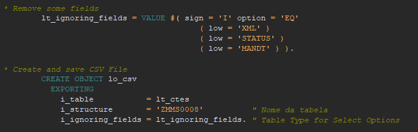
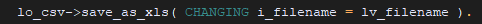

# Cria/salva arquivo .CSV
 Classe para criar e salvar arquivos com extensão .csv
 
 [Link programa exemplo utilizando a classe](src/zcsv_example.prog.abap)
 
## Exemplo de uso

Para utilizar basta criar o objeto informando os atributos:
- i_table -> Qualquer tabela interna criada
- i_structure -> Nome da estrutura com os campos que serão levados para o arquivo .CSV
- i_ignoring_fields -> Tabela de range com nome dos campos da estrutura informada que devem ser desconsiderados na criação do arquivo
 

 
Após a criação do objeto chamar o método **save** informando o nome do arquivo.  
*Obs: Será aberto uma caixa de diálogo para o usuário escolher o local de salvar o arquivo.*
 

Existe também a opção de salvar o arquivo na extensão .XLS.
Para isso chamar o método **save_as_xls** informando o nome do arquivo como no exemplo anterior.

 
 
